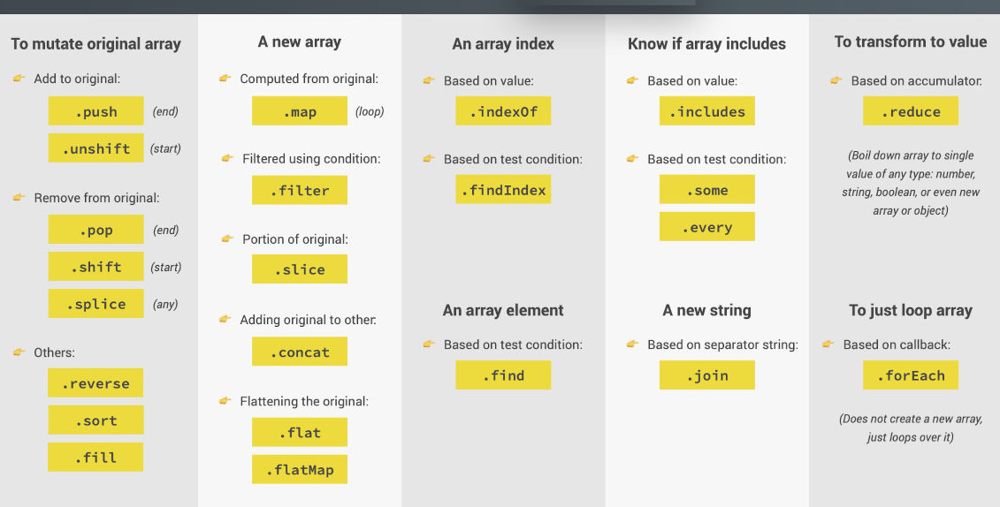

## ARRAYS

### **Intro**:

In JavaScript, arrays are probably the most commonly used data structure.
JavaScript has countless modern array methods that we can also think of as array tools.
In this section, I will be learning all about these tools, how to use them, and more importantly, when to use them.
A small project will be made, so that I can practically learn all these tools for working with arrays.

#

## Everything I learned in this section about array methods and working with them can be summarized in this beautiful image. Better than in this image, I could not describe in words. All rights to the image belong to the author of the course.

